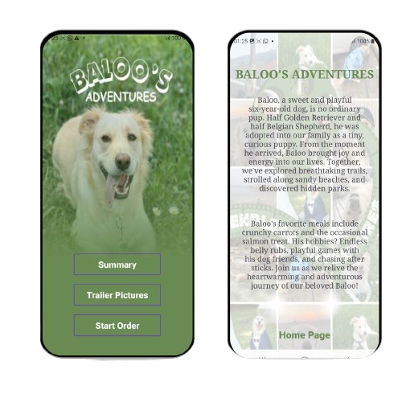
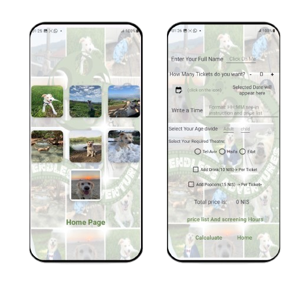

🐾 The Baloo Adventures App 🐶 
Welcome to The Baloo Adventures app! 
This is my first Android project, inspired by my amazing dog, Baloo. 🐕 
The app showcases the basics of Android development while providing a fun and interactive way to explore Baloo's exciting adventures.  

🌟 Features 
📖 Storybook Mode: Read through Baloo's exciting stories with colorful images and charming details. 
📸 Photo Gallery: Browse a gallery filled with adorable pictures of Baloo's adventures. 
🗺️ Adventure Map: Explore the places Baloo has visited, with interactive map features. 
🎶 Interactive Sounds: Play fun sounds that represent Baloo's moods and activities. 
🎨 Customizable UI: Choose your favorite themes and colors for a personalized experience. 
🌍 Multi-language Support: The app supports both English and Hebrew for a broader audience.  

🛠 Tools and Technologies 
💻 Programming Language: Kotlin 
🎨 UI Design: XML 
🛠️ Development Environment: Android Studio  

🐾 How It Works 
1️⃣ Open the app to dive into The Baloo Adventures storybook mode. Flip through the pages to uncover fun adventures with engaging illustrations. 📖✨ 
2️⃣ Head over to the Photo Gallery to browse Baloo's cutest moments, from playing in the park to napping on the couch. 📸🐶 
3️⃣ Use the Adventure Map to see Baloo's favorite destinations and interact with markers for more information. 🗺️🌟 
4️⃣ Enjoy Interactive Sounds that bring Baloo's adventures to life – bark, play, and more! 🎶🐾  

📸 Screenshots 
 
 
 
[Watch the video](https://drive.google.com/file/d/1QDT2FZF5eM4RskeMUhPuvhWud0ZA1Bvk/view?usp=sharing)
